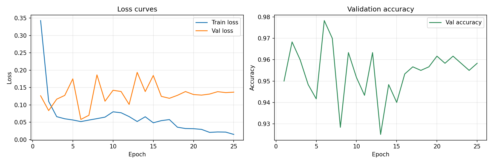
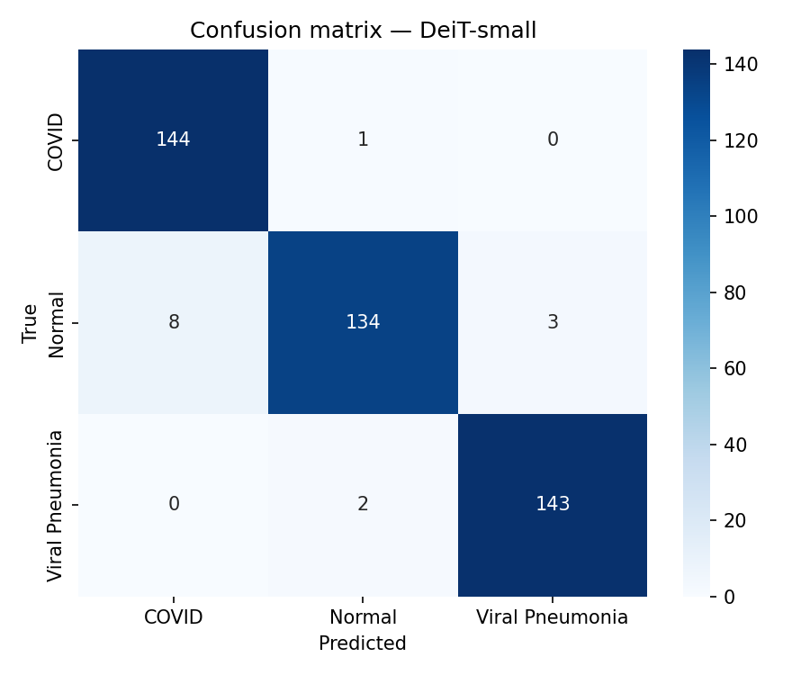
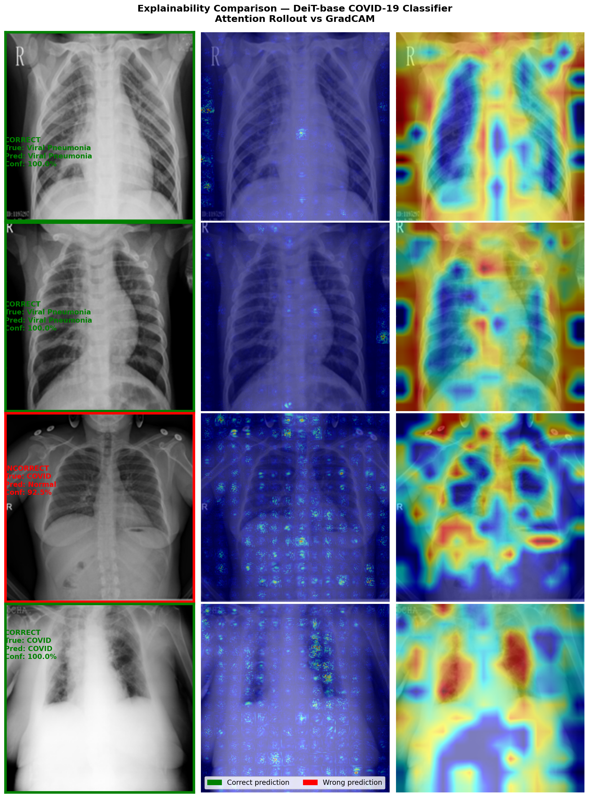

# COVID-19 Chest X-Ray Vision: Explained Classification with DeiT

This repository contains a high-performance deep learning pipeline for classifying Chest X-ray (CXR) images into three categories: **COVID-19**, **Normal**, and **Viral Pneumonia**. The model uses the **Data-efficient Image Transformer (DeiT)** architecture and includes comparative Explainable AI (XAI) visualizations.

## 🚀 Key Features

- **Model Architecture**: `DeiT-base` (Vision Transformer adapted for efficiency).
- **High Accuracy**: Successfully achieves **96.78%** accuracy on the test set.
- **Explainable AI**: Side-by-side comparison of **Attention Rollout** and **GradCAM** to understand model decision-making.
- **Robust Training**: Implements class weighing for imbalance, AdamW optimizer, and Cosine Annealing learning rate schedule.

## 📊 Performance Metrics

The model demonstrates excellent performance across all classes, with balanced precision and recall.

| Class | Precision | Recall | F1-Score | Support |
| :--- | :---: | :---: | :---: | :---: |
| **COVID** | 0.9474 | 0.9931 | 0.9697 | 145 |
| **Normal** | 0.9781 | 0.9241 | 0.9504 | 145 |
| **Viral Pneumonia** | 0.9795 | 0.9862 | 0.9828 | 145 |
| **Average / Total** | **0.9683** | **0.9678** | **0.9676** | **435** |

### Training History
The model was trained for 25 epochs. The curves show stable convergence and effective learning.



### Confusion Matrix
The confusion matrix highlights the high reliability in distinguishing between the three classes.



## 🔍 Explainable AI (XAI) Comparison

To ensure transparency, we compare two distinct methods for visual explanation:

1.  **Attention Rollout**: Native to Transformers, it traces how attention maps flow from the first to the last layer.
2.  **GradCAM**: A gradient-based method that highlights regions of interest in the final transformer blocks.



*The visualization shows the Original image, the Attention Rollout heatmap, and the GradCAM overlay (left to right).*

## 🛠️ Installation & Setup

1.  **Clone the repository**:
    ```bash
    git clone <repository-url>
    cd aims_task
    ```

2.  **Install dependencies**:
    ```bash
    pip install -r requirements.txt
    ```

3.  **Ensure Dataset Structure**:
    The dataset should be placed in `COVID_19_dataset/` with subfolders `train/`, `val/`, and `test/`.

## 💻 Usage

### Training the Model
To start training the DeiT model:
```bash
python train.py
```

### Running Explainability (XAI)
To generate the XAI comparison and metrics:
```bash
python explainable_model.py
```

## 📂 Project Structure

- `explainable_model.py`: Main script for XAI visualization and evaluation.
- `train.py`: Training script for the DeiT model.
- `evaluation_scores.py`: Detailed performance evaluation on the test set.
- `deit_best.pth`: Best performing model checkpoint.
- `COVID_19_dataset/`: Image repository (Train/Val/Test).
- `explainability_comparison.png`: Generated XAI side-by-side visualization.
- `training_curves.png`: Loss and accuracy visualization.
- `confusion_matrix.png`: Model performance breakdown.

---
*Created for DTU-Explainable-Vision task.*
